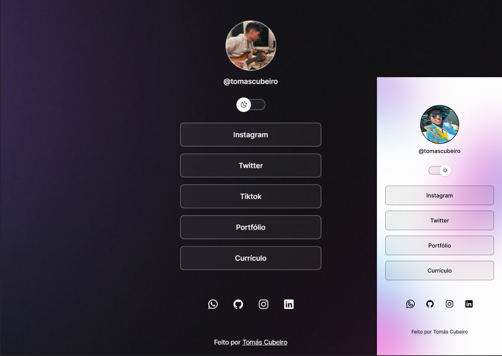

<h1 align="center"> Linktree Tomás Cubeiro </h1>

Linktree para ter fácil acesso a todas as minhas informações importantes, como:   Currículo, portfólio e redes sociais.

  <a href="#-tecnologias">Tecnologias</a>&nbsp;&nbsp;&nbsp;|&nbsp;&nbsp;&nbsp;
  <a href="#-projeto">Projeto</a>&nbsp;&nbsp;&nbsp;|&nbsp;&nbsp;&nbsp;
  <a href="#-layout">Layout</a>&nbsp;&nbsp;&nbsp;|&nbsp;&nbsp;&nbsp;
  <a href="#memo-licença">Licença</a>

  

 

  

## 🚀 Tecnologias

Esse projeto foi desenvolvido com as seguintes tecnologias:

- HTML e CSS
- JavaScript
- Git e Github
- Figma

## 💻 Projeto

A Linktree é um agregador de links para usar como cartão de visitas online.

- [Acesse o projeto finalizado, online] (Link projeto)

## :memo: Licença

Esse projeto está sob a licença MIT.

---

Feito por Tomás Cubeiro
